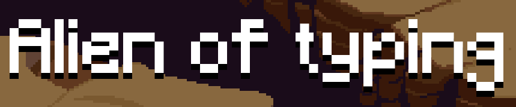
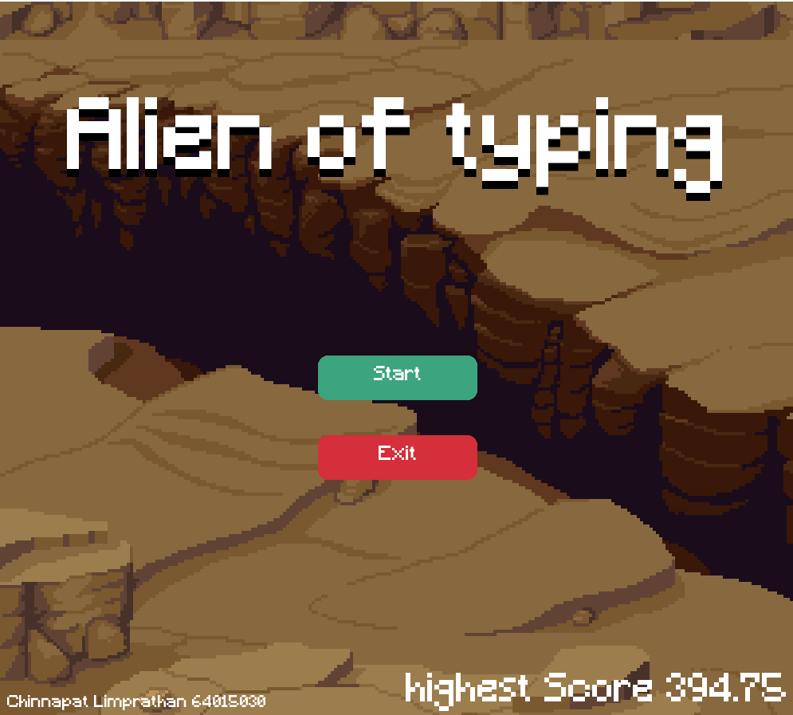
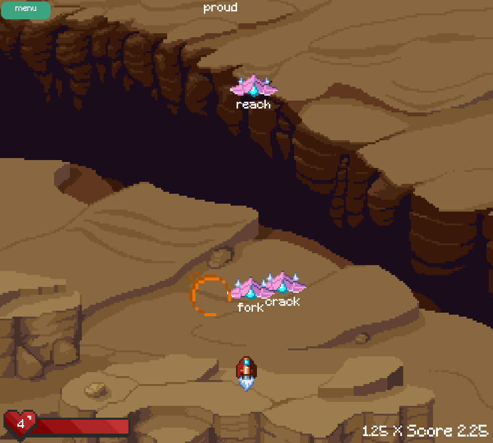

#  Alien of typing 



space invaders but typing !!
std project at KMITL

## 🎮 Gameplay

### menu 🚀



### gamplay 🎯



## Requires 📃

- pygame

```cmd
pip install pygame
```

- pyinstaller (optional) for build

```cmd
pip install pyinstaller
```

or install from requirements file

```cmd
pip install -r requirements.txt
```

## How to run 🏃‍♀️

run the file by using python

```cmd
py main.py
```

or build file .exe and run

```cmd
pyinstaller --onefile --windowed --icon=app.ico main.py
```
